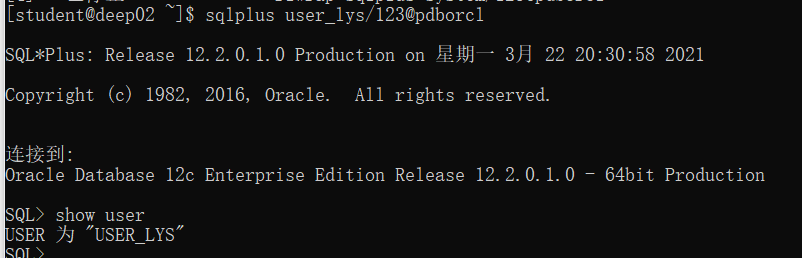
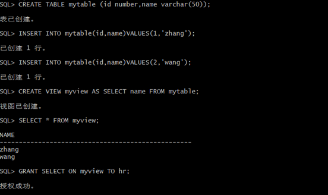
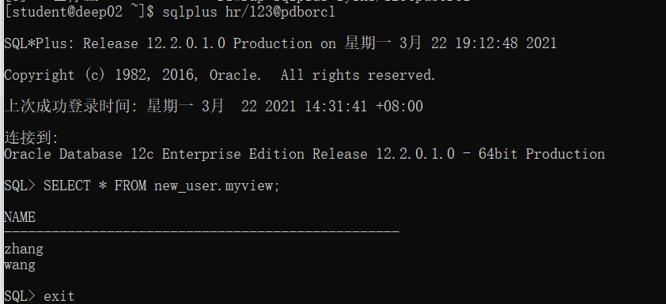
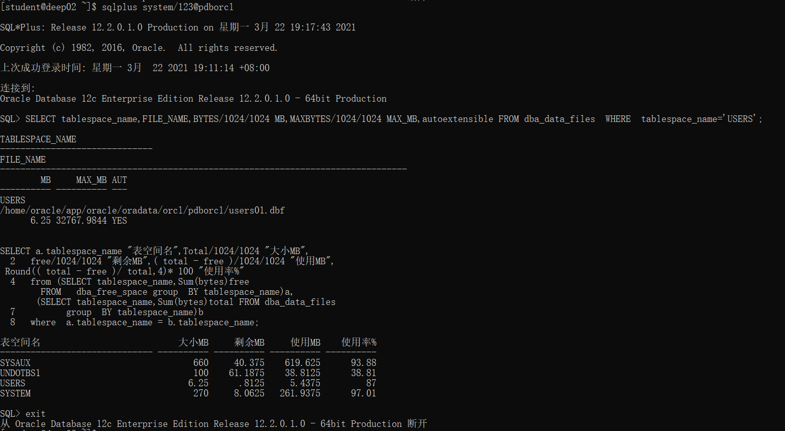

# 实验2：用户及权限管理

## 1. 实验目的

掌握用户管理、角色管理、权根维护与分配的能力，掌握用户之间共享对象的操作技能。

## 2. 实验内容

Oracle有一个开发者角色resource，可以创建表、过程、触发器等对象，但是不能创建视图。本训练要求：

- 在pdborcl插接式数据中创建一个新的本地角色con_res_view，该角色包含connect和resource角色，同时也包含CREATE VIEW权限，这样任何拥有con_res_view的用户就同时拥有这三种权限。
- 创建角色之后，再创建用户new_user，给用户分配表空间，设置限额为50M，授予con_res_view角色。
- 最后测试：用新用户new_user连接数据库、创建表，插入数据，创建视图，查询表和视图的数据。

## 3. 试验过程及截图

1. 创建角色lyins和用户new_user，并授权和分配空间：

   ```sql
   CREATE ROLE lyins;
   GRANT connect,resource,CREATE VIEW TO lyins;
   ```

   运行结果：


2. 授权和分配空间

   ```sql
   GRANT connect,resource,CREATE VIEW TO lyins;
   CREATE USER lyins IDENTIFIED BY 123 DEFAULT TABLESPACE users TEMPORARY TABLESPACE temp;
   ALTER USER lyins QUOTA 50M ON users;
   GRANT lyins TO new_user;
   ```

3. 用新用户连接到pdborcl，创建表mytable和视图myview，插入数据，最后将myview的SELECT对象权限授予hr用户。

   ```sql
   sqlplus new_user/123@pdborcl
   SHOW user;
   CREATE TABLE mytable (id number,name varchar(50));
   INSERT INTO mytable(id,name)VALUES(1,'zhang');
   INSERT INTO mytable(id,name)VALUES (2,'wang');
   CREATE VIEW myview AS SELECT name FROM mytable;
   SELECT * FROM myview;
   GRANT SELECT ON myview TO hr;
   ```

   运行截图：

   

   

4. 用户hr连接到pdborcl，查询new_user授予它的视图myview

   ```sql
   sqlplus hr/123@pdborcl
   SELECT * FROM new_user.myview;
   ```

   运行截图:

   

5. 查看数据库的使用情况

   ```sql
   SELECT tablespace_name,FILE_NAME,BYTES/1024/1024 MB,MAXBYTES/1024/1024 MAX_MB,autoextensible FROM dba_data_files  WHERE  tablespace_name='USERS';
   SELECT a.tablespace_name "表空间名",Total/1024/1024 "大小MB",
    free/1024/1024 "剩余MB",( total - free )/1024/1024 "使用MB",
    Round(( total - free )/ total,4)* 100 "使用率%"
    from (SELECT tablespace_name,Sum(bytes)free
           FROM   dba_free_space group  BY tablespace_name)a,
          (SELECT tablespace_name,Sum(bytes)total FROM dba_data_files
           group  BY tablespace_name)b
    where  a.tablespace_name = b.tablespace_name;
   ```

   运行截图：

   

## 4. 试验总结
本次试验学习了用户管理、角色管理、权限维护与分配和用户之间共享对象等，创建角色命令是CREATE ROLE，创建用户命令是CREATE USER，使用ALTER 命令修改用户，使用GRNAT ... TO ...给用户授予权限。 建表语句、插入和查询语句跟之前学的MYSQL命令类似，最后查询新建的用户授予的视图。试验过程中，没有遇到什么问题，跟着实例代码敲就行了。


