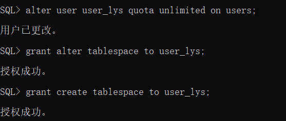
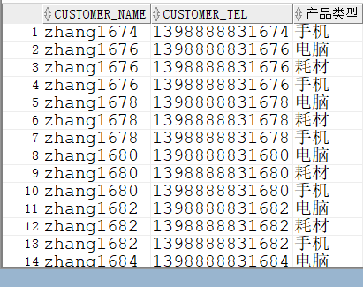
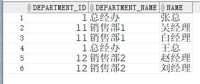

# 实验4：对象管理

## 实验目的：

了解Oracle表和视图的概念，学习使用SQL语句Create Table创建表，学习Select语句插入，修改，删除以及查询数据，学习使用SQL语句创建视图，学习部分存储过程和触发器的使用。

## - 实验场景：

假设有一个生产某个产品的单位，单位接受网上订单进行产品的销售。通过实验模拟这个单位的部分信息：员工表，部门表，订单表，订单详单表。

## 实验内容：

### 录入数据：

要求至少有1万个订单，每个订单至少有4个详单。至少有两个部门，每个部门至少有1个员工，其中只有一个人没有领导，一个领导至少有一个下属，并且它的下属是另一个人的领导（比如A领导B，B领导C）。

### 序列的应用

插入ORDERS和ORDER_DETAILS 两个表的数据时，主键ORDERS.ORDER_ID, ORDER_DETAILS.ID的值必须通过序列SEQ_ORDER_ID和SEQ_ORDER_ID取得，不能手工输入一个数字。

### 触发器的应用：

维护ORDER_DETAILS的数据时（insert,delete,update）要同步更新ORDERS表订单应收货款ORDERS.Trade_Receivable的值。

### 查询数据：

```reStructuredText
1.查询某个员工的信息
2.递归查询某个员工及其所有下属，子下属员工。
3.查询订单表，并且包括订单的订单应收货款: Trade_Receivable= sum(订单详单表.ProductNum*订单详单表.ProductPrice)- Discount。
4.查询订单详表，要求显示订单的客户名称和客户电话，产品类型用汉字描述。
5.查询出所有空订单，即没有订单详单的订单。
6.查询部门表，同时显示部门的负责人姓名。
7.查询部门表，统计每个部门的销售总金额。
```

## 实验过程及记录

### 一.实验环境搭建

1. **登录system用户，然后为用户user_lys授权。**

   ```sql
   alter user user_lys quota unlimited on USERS001;
   
   grant alter tablespace to user_lys;
   grant create tablespace to user_lys;
   ```




2. **创建表DEPARTMENTS**

   ```sql
   CREATE TABLE DEPARTMENTS
   (
     DEPARTMENT_ID NUMBER(6, 0) NOT NULL
   , DEPARTMENT_NAME VARCHAR2(40 BYTE) NOT NULL
   , CONSTRAINT DEPARTMENTS_PK PRIMARY KEY
     (
       DEPARTMENT_ID
     )
     USING INDEX
     (
         CREATE UNIQUE INDEX DEPARTMENTS_PK ON DEPARTMENTS (DEPARTMENT_ID ASC)
         NOLOGGING
         TABLESPACE USERS001
         PCTFREE 10
         INITRANS 2
         STORAGE
         (
           INITIAL 65536
           NEXT 1048576
           MINEXTENTS 1
           MAXEXTENTS UNLIMITED
           BUFFER_POOL DEFAULT
         )
         NOPARALLEL
     )
     ENABLE
   )
   NOLOGGING
   TABLESPACE USERS001
   PCTFREE 10
   INITRANS 1
   STORAGE
   (
     INITIAL 65536
     NEXT 1048576
     MINEXTENTS 1
     MAXEXTENTS UNLIMITED
     BUFFER_POOL DEFAULT
   )
   NOCOMPRESS NO INMEMORY NOPARALLEL;
   ```

3. **创建表EMPLOYEES**

   ```sql
   CREATE TABLE EMPLOYEES
   (
     EMPLOYEE_ID NUMBER(6, 0) NOT NULL
   , NAME VARCHAR2(40 BYTE) NOT NULL
   , EMAIL VARCHAR2(40 BYTE)
   , PHONE_NUMBER VARCHAR2(40 BYTE)
   , HIRE_DATE DATE NOT NULL
   , SALARY NUMBER(8, 2)
   , MANAGER_ID NUMBER(6, 0)
   , DEPARTMENT_ID NUMBER(6, 0)
   , PHOTO BLOB
   , CONSTRAINT EMPLOYEES_PK PRIMARY KEY
     (
       EMPLOYEE_ID
     )
     USING INDEX
     (
         CREATE UNIQUE INDEX EMPLOYEES_PK ON EMPLOYEES (EMPLOYEE_ID ASC)
         NOLOGGING
         TABLESPACE USERS001
         PCTFREE 10
         INITRANS 2
         STORAGE
         (
           INITIAL 65536
           NEXT 1048576
           MINEXTENTS 1
           MAXEXTENTS UNLIMITED
           BUFFER_POOL DEFAULT
         )
         NOPARALLEL
     )
     ENABLE
   )
   NOLOGGING
   TABLESPACE USERS001
   PCTFREE 10
   INITRANS 1
   STORAGE
   (
     INITIAL 65536
     NEXT 1048576
     MINEXTENTS 1
     MAXEXTENTS UNLIMITED
     BUFFER_POOL DEFAULT
   )
   NOCOMPRESS
   NO INMEMORY
   NOPARALLEL
   LOB (PHOTO) STORE AS SYS_LOB0000092017C00009$$
   (
     ENABLE STORAGE IN ROW
     CHUNK 8192
     NOCACHE
     NOLOGGING
     TABLESPACE USERS001
     STORAGE
     (
       INITIAL 106496
       NEXT 1048576
       MINEXTENTS 1
       MAXEXTENTS UNLIMITED
       BUFFER_POOL DEFAULT
     )
   );
   
   CREATE INDEX EMPLOYEES_INDEX1_NAME ON EMPLOYEES (NAME ASC)
   NOLOGGING
   TABLESPACE USERS001
   PCTFREE 10
   INITRANS 2
   STORAGE
   (
     INITIAL 65536
     NEXT 1048576
     MINEXTENTS 1
     MAXEXTENTS UNLIMITED
     BUFFER_POOL DEFAULT
   )
   NOPARALLEL;
   
   ALTER TABLE EMPLOYEES
   ADD CONSTRAINT EMPLOYEES_FK1 FOREIGN KEY
   (
     DEPARTMENT_ID
   )
   REFERENCES DEPARTMENTS
   (
     DEPARTMENT_ID
   )
   ENABLE;
   
   ALTER TABLE EMPLOYEES
   ADD CONSTRAINT EMPLOYEES_FK2 FOREIGN KEY
   (
     MANAGER_ID
   )
   REFERENCES EMPLOYEES
   (
     EMPLOYEE_ID
   )
   ON DELETE SET NULL ENABLE;
   
   ALTER TABLE EMPLOYEES
   ADD CONSTRAINT EMPLOYEES_CHK1 CHECK
   (SALARY>0)
   ENABLE;
   
   ALTER TABLE EMPLOYEES
   ADD CONSTRAINT EMPLOYEES_CHK2 CHECK
   (EMPLOYEE_ID<>MANAGER_ID)
   ENABLE;
   
   ALTER TABLE EMPLOYEES
   ADD CONSTRAINT EMPLOYEES_EMPLOYEE_MANAGER_ID CHECK
   (MANAGER_ID<>EMPLOYEE_ID)
   ENABLE;
   
   ALTER TABLE EMPLOYEES
   ADD CONSTRAINT EMPLOYEES_SALARY CHECK
   (SALARY>0)
   ENABLE;
   ```

4. **创建表PRODUCTS**

   ```sql
   CREATE TABLE PRODUCTS
   (
     PRODUCT_NAME VARCHAR2(40 BYTE) NOT NULL
   , PRODUCT_TYPE VARCHAR2(40 BYTE) NOT NULL
   , CONSTRAINT PRODUCTS_PK PRIMARY KEY
     (
       PRODUCT_NAME
     )
     ENABLE
   )
   LOGGING
   TABLESPACE "USERS001"
   PCTFREE 10
   INITRANS 1
   STORAGE
   (
     INITIAL 65536
     NEXT 1048576
     MINEXTENTS 1
     MAXEXTENTS 2147483645
     BUFFER_POOL DEFAULT
   );
   
   ALTER TABLE PRODUCTS
   ADD CONSTRAINT PRODUCTS_CHK1 CHECK
   (PRODUCT_TYPE IN ('耗材', '手机', '电脑'))
   ENABLE;
   ```

5. **创建表ORDERS**

   ```sql
   CREATE TABLE ORDERS
   (
     ORDER_ID NUMBER(10, 0) NOT NULL
   , CUSTOMER_NAME VARCHAR2(40 BYTE) NOT NULL
   , CUSTOMER_TEL VARCHAR2(40 BYTE) NOT NULL
   , ORDER_DATE DATE NOT NULL
   , EMPLOYEE_ID NUMBER(6, 0) NOT NULL
   , DISCOUNT NUMBER(8, 2) DEFAULT 0
   , TRADE_RECEIVABLE NUMBER(8, 2) DEFAULT 0
   )
   TABLESPACE USERS001
   PCTFREE 10
   INITRANS 1
   STORAGE
   (
     BUFFER_POOL DEFAULT
   )
   NOCOMPRESS
   NOPARALLEL
   PARTITION BY RANGE (ORDER_DATE)
   (
     PARTITION PARTITION_BEFORE_2016 VALUES LESS THAN (TO_DATE(' 2016-01-01 00:00:00', 'SYYYY-MM-DD HH24:MI:SS', 'NLS_CALENDAR=GREGORIAN'))
     NOLOGGING
     TABLESPACE USERS001
     PCTFREE 10
     INITRANS 1
     STORAGE
     (
       INITIAL 8388608
       NEXT 1048576
       MINEXTENTS 1
       MAXEXTENTS UNLIMITED
       BUFFER_POOL DEFAULT
     )
     NOCOMPRESS NO INMEMORY
   , PARTITION PARTITION_BEFORE_2017 VALUES LESS THAN (TO_DATE(' 2017-01-01 00:00:00', 'SYYYY-MM-DD HH24:MI:SS', 'NLS_CALENDAR=GREGORIAN'))
     NOLOGGING
     TABLESPACE USERS002
     PCTFREE 10
     INITRANS 1
     STORAGE
     (
       INITIAL 8388608
       NEXT 1048576
       MINEXTENTS 1
       MAXEXTENTS UNLIMITED
       BUFFER_POOL DEFAULT
     )
     NOCOMPRESS NO INMEMORY
   );
   
   --创建本地分区索引ORDERS_INDEX_DATE：
   CREATE INDEX ORDERS_INDEX_DATE ON ORDERS (ORDER_DATE ASC)
   LOCAL
   (
     PARTITION PARTITION_BEFORE_2016
       TABLESPACE USERS001
       PCTFREE 10
       INITRANS 2
       STORAGE
       (
         INITIAL 8388608
         NEXT 1048576
         MINEXTENTS 1
         MAXEXTENTS UNLIMITED
         BUFFER_POOL DEFAULT
       )
       NOCOMPRESS
   , PARTITION PARTITION_BEFORE_2017
       TABLESPACE USERS002
       PCTFREE 10
       INITRANS 2
       STORAGE
       (
         INITIAL 8388608
         NEXT 1048576
         MINEXTENTS 1
         MAXEXTENTS UNLIMITED
         BUFFER_POOL DEFAULT
       )
       NOCOMPRESS
   )
   STORAGE
   (
     BUFFER_POOL DEFAULT
   )
   NOPARALLEL;
   
   CREATE INDEX ORDERS_INDEX_CUSTOMER_NAME ON ORDERS (CUSTOMER_NAME ASC)
   NOLOGGING
   TABLESPACE USERS001
   PCTFREE 10
   INITRANS 2
   STORAGE
   (
     INITIAL 65536
     NEXT 1048576
     MINEXTENTS 1
     MAXEXTENTS UNLIMITED
     BUFFER_POOL DEFAULT
   )
   NOPARALLEL;
   
   CREATE UNIQUE INDEX ORDERS_PK ON ORDERS (ORDER_ID ASC)
   GLOBAL PARTITION BY HASH (ORDER_ID)
   (
     PARTITION INDEX_PARTITION1 TABLESPACE USERS001
       NOCOMPRESS
   , PARTITION INDEX_PARTITION2 TABLESPACE USERS002
       NOCOMPRESS
   )
   NOLOGGING
   TABLESPACE USERS001
   PCTFREE 10
   INITRANS 2
   STORAGE
   (
     INITIAL 65536
     NEXT 1048576
     MINEXTENTS 1
     MAXEXTENTS UNLIMITED
     BUFFER_POOL DEFAULT
   )
   NOPARALLEL;
   
   ALTER TABLE ORDERS
   ADD CONSTRAINT ORDERS_PK PRIMARY KEY
   (
     ORDER_ID
   )
   USING INDEX ORDERS_PK
   ENABLE;
   
   ALTER TABLE ORDERS
   ADD CONSTRAINT ORDERS_FK1 FOREIGN KEY
   (
     EMPLOYEE_ID
   )
   REFERENCES EMPLOYEES
   (
     EMPLOYEE_ID
   )
   ENABLE;
   ```

6.  **创建表ORDER_DETAILS**

   ```sql
   CREATE TABLE ORDER_DETAILS 
   (
     ID NUMBER(10, 0) NOT NULL 
   , ORDER_ID NUMBER(10, 0) NOT NULL 
   , PRODUCT_NAME VARCHAR2(40 BYTE) NOT NULL 
   , PRODUCT_NUM NUMBER(8, 2) NOT NULL 
   , PRODUCT_PRICE NUMBER(8, 2) NOT NULL 
   , CONSTRAINT ORDER_DETAILS_PK PRIMARY KEY 
     (
       ID 
     )
     USING INDEX 
     (
         CREATE UNIQUE INDEX ORDER_DETAILS_PK ON ORDER_DETAILS (ID ASC) 
         LOGGING 
         TABLESPACE USERS 
         PCTFREE 10 
         INITRANS 2 
         STORAGE 
         ( 
           BUFFER_POOL DEFAULT 
         ) 
         NOPARALLEL 
     )
     ENABLE 
   ) 
   LOGGING 
   TABLESPACE USERS 
   PCTFREE 10 
   INITRANS 1 
   STORAGE 
   ( 
     BUFFER_POOL DEFAULT 
   ) 
   NOCOMPRESS 
   NO INMEMORY 
   NOPARALLEL;
   
   ALTER TABLE ORDER_DETAILS
   ADD CONSTRAINT ORDER_DETAILS_FK1_001 FOREIGN KEY
   (
     ID 
   )
   REFERENCES ORDER_DETAILS
   (
     ID 
   )
   ENABLE;
   ```

### 二.查询数据

   * 查询员工的信息

     ```sql
     select *from employees where employee_id=1;
     ```

     

   * 递归查询某个员工及其所有下属，子下属员工。

     ```sql
     SELECT * FROM employees START WITH EMPLOYEE_ID = 1 CONNECT BY PRIOR EMPLOYEE_ID = MANAGER_ID;
     ```

     

   * 查询订单表，并且包括订单的订单应收货款: Trade_Receivable= sum(订单详单表.ProductNum*订单详单表.ProductPrice)- Discount。

     ```sql
     select *FROM orders;
     ```

     

   * 查询订单详表，要求显示订单的客户名称和客户电话，产品类型用汉字描述。

     ```sql
     select o.customer_name,o.customer_tel, p.product_type AS 产品类型
     FROM orders o,order_details d,products p
     where o.order_id=d.order_id
     and d.product_name=p.product_name;
     ```

     

   * 查询出所有空订单，即没有订单详单的订单。

     ```sql
     select * 
     from orders
     where order_id NOT in(SELECT o.order_id from orders o,order_details d WHERE o.order_id=d.order_id);
     ```

   * 查询部门表，同时显示部门的负责人姓名。

     ```sql
     select d.*,e.name
     from departments d,employees e
     where d.department_id=e.department_id
     and e.manager_id=d.department_id;
     ```

     

   * 查询部门表，统计每个部门的销售总金额。

     ```sql
     select d.department_name,SUM(sum1)
     FROM (
     select (d.product_num*d.product_price) sum1
     from order_details d,orders o,departments d,employees e
     WHERE d.department_id=e.department_id
     and o.employee_id = e.employee_id
     and o.order_id=d.order_id
     ),departments d
     group by d.department_name;
     ```

     

## 实验总结

本次实验学习了Oracle数据库表和视图，学习了表的查找、修改、添加、删除语句，视图的创建，存储过程和触发器的简单使用。实验中的表是根据某个生产单位的数据库模型进行创建，主要有员工表、部门表、订单表、订单详情表。实验开始使用脚本录入上万条数据，然后编写查询语句。实验中遇到了许多问题，由于不熟悉Oracle数据库的语法，查询语句编写起来比较困难，查询资料学习后，才慢慢的写了出来。

